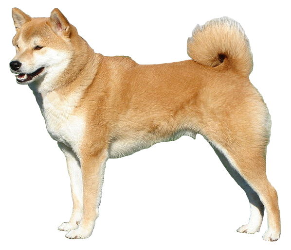
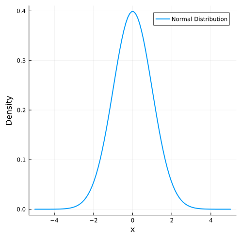

<!-- _header: Main Topic -->

 Main Topic 

# Write Main Topic Here

---

# Shiba Inu is one of the most popular dog breeds in Japan.

---

<!-- _header: Normal Distribution -->

$$
f(x) = \frac{1}{\sqrt{2\pi\sigma^2}} e^{-\frac{(x-\mu)^2}{2\sigma^2}}
$$

---